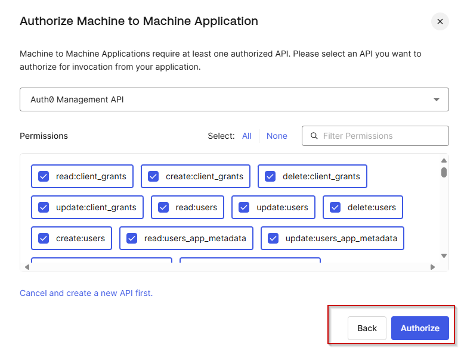
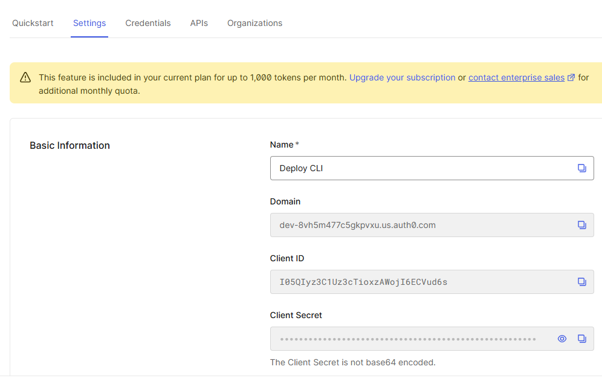
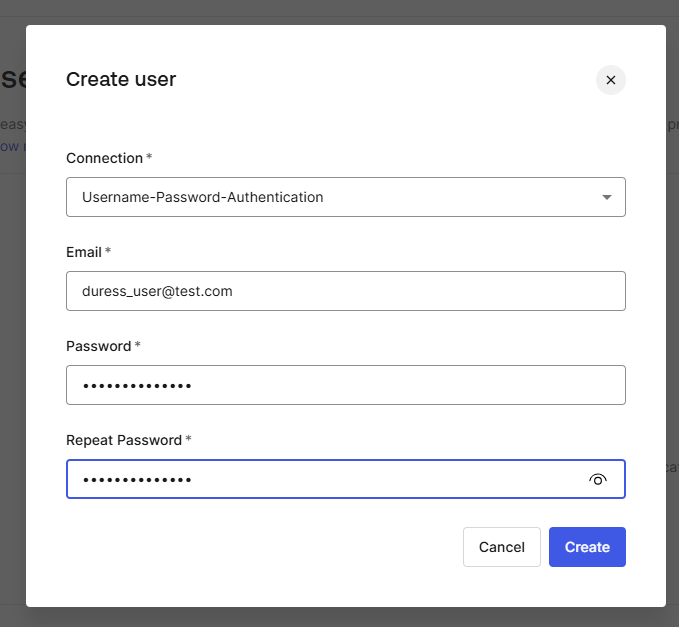
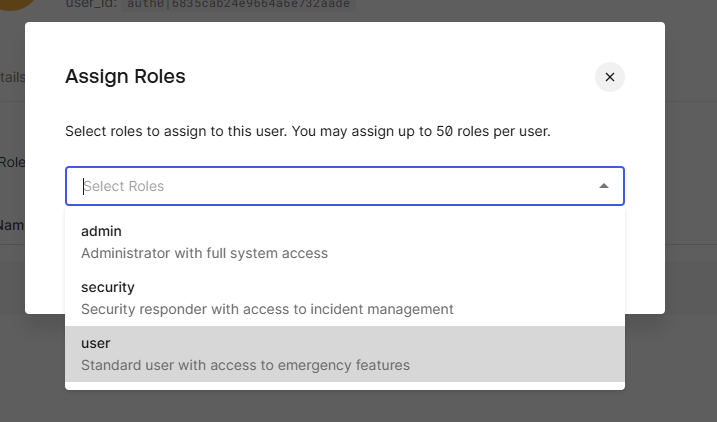

# Input required

- Auth0 tenant
- Auth0 clientid (cli app)
- Auth0 clientsecret (cli app)
- Sendgrid api key
- web url
- api url

# Preparation

## Configure file permissions

```
cd apps
cp .env.example .env
chmod +x expo/docker-entrypoint.sh
chmod +x api/Api/docker-entrypoint.sh
chmod +x infra/web-push/generate-vapid-env.sh
chmod +x infra/auth0/update-auth0-env-values.sh
chmod 777 ./api/Api/appsettings.Development.json
chmod 777 .env
```

## Build the util containers

```
docker compose -f compose-infra.yml  build
```

## Web Push

The following command will generate web push public and private key and update .env file

```
docker compose -f compose-infra.yml run --rm webpush
```

# External Dependencies

## Auth0

### Configure Deploy CLI

- Sign up for auth0 account
- Go to applications, click on create application
  
- Choose Machine to machine and click Create
  
- Choose Auth0 Management API and click Authorize
  
- Go to settings and take note of these values - client id - secret - domain
  
- Run

```
cp apps/.env.example apps/.env
```

- Enter to apps/.env

| .env                | Auth0     |
| ------------------- | --------- |
| AUTH0_CLIENT_ID     | Client ID |
| AUTH0_CLIENT_SECRET | Secret    |
| AUTH0_DOMAIN        | Domain    |

### Import Auth0 Configuration

```
docker compose -f compose-infra.yml run --rm auth0-import
```

### Update auth0 env values

This process will grab client id values and update .env

```
docker compose -f compose-infra.yml run --rm auth0-update-env-values
```

### Configure Users

- Go to User Management --> Users
  
- Create a user, specifying a dummy email address and set a password, then click Create
  
- Go to the Roles tab and click Assign Roles
  
- Pick User
  
- Repeat the process for 'Security' and 'Admin' role

## Sendgrid

Refer to Sendgrid setup [Link]

- update apps/.env with the generated api key

# Starting docker containers

```
cp ./expo/.env.example ./expo/.env
docker compose build
docker compose up -d
```

# Other operations

## Export auth0

```
docker compose -f compose-infra.yml run --rm auth0-export
```
